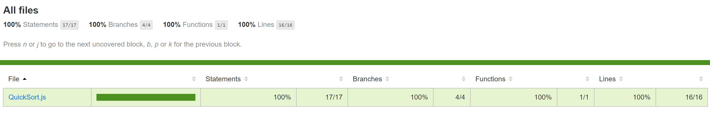
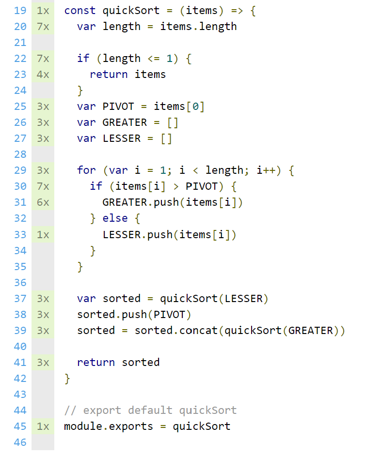

# sifchain-assessment
This is an assessment made for Sifchain hiring process

## Installation
You should have the latest [Node.js](https://nodejs.org/en/download/) installed. Then
```
npm install
```
## Execution
To run tests, run
```
npm test
```

To run tests with code coverage enabled, run
```
npm run test:coverage
```

## Reporting and logs

By default, `mochawesome` reporter is enabled which means that `html` report is generated. Search for `mochawesome.html` file under
```
mochawesome-report/
```
Test output is also logged to intermediate JSON file `mochawesome.json` (under the same directory)

When code coverage is enabled (with `nyc` package), it is presented under
```
coverage/lcov-report
```
directory, where `index.html` is located. The report covers:
* statements
* branches
* functions
* lines

### Example coverage report





## Notes

Separate test implementation comments are put in each of the `spec` files:
```
test/black-box.spec.js
test/white-box.spec.js
```